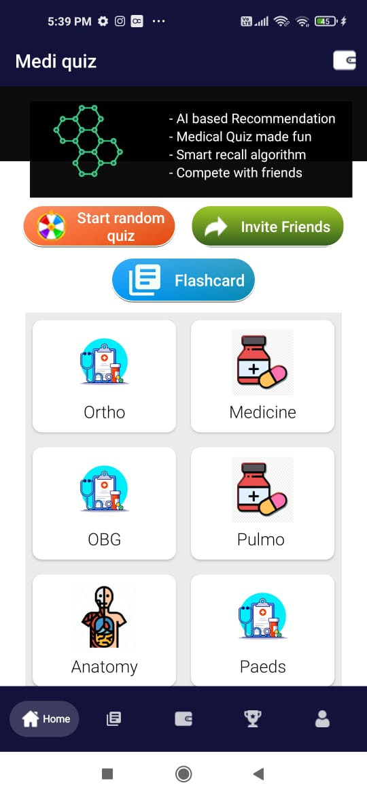
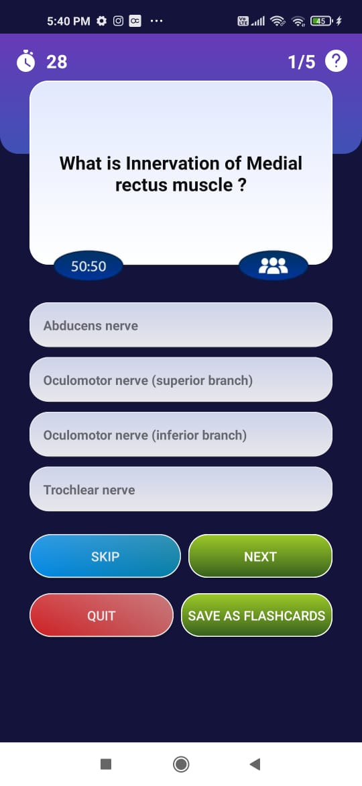

# Medi quiz    

AI powered medical quiz app

IN DEVELOPMENT PHASE

## Features to include

- [ ] Using Knowledge graphs and Ontologies to generate questions
- [ ] Automatic Smart options generation
- [ ] Using AutoML and un-supervised learning to categorize questions
- [x] Create in-app Flashcards
- [ ] Read, review Flashcards, with smart recall algorithm
- [ ] Recommendations on topics to study
- [ ] Collect community questions too
- [x] Leatherboard for people

Link to ontologies being created -  link

Link to Sample Question database generated - link

Link to code for Knowledge graph generation - link

## Goals - 
- [x] Basic quizing interface
- [x] Basic flashcard review interface
- [x] Add Signup and SignIn modality
- [x] Connect Firestore
- [x] Populate seed questions
- [ ] Generate questions from Ontologies
- [ ] Add flashcard from quiz functionality
- [ ] Generate questions and flashcard tags to track and recommend
- [ ] Recommendation algorithm inside app
- [x] Leatherboard for progress
- [ ] Reward system 
- [ ] Submission form for community questions
- [ ] Track your progress bar

Frameworks used - 
- Model training - Tensorflow lite
- Android deployment - Kotlin and Android Studio

App size -  
Coverage of Android devices - more than 98% 

## Screenshots
| Home screen                  |  Quiz screen | 
| :---:                     |     :---:      |   
|  |    |

P.S. -This project would not have been feassible without my creative discussion with - Dr. Akshdeep singh
